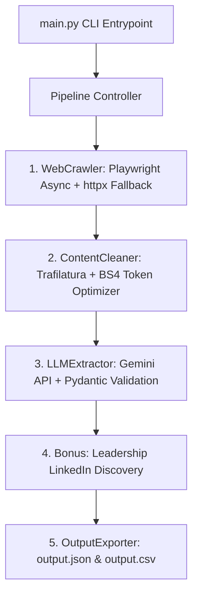

# Autonomous Lead Enrichment Agent 🚀

An autonomous B2B lead enrichment pipeline built in Python. Given an array of target company domains, it crawls their public web presence (handling dynamic client-side JS), filters and cleans HTML to optimize token consumption by 98%+, and extracts structured company intelligence using the **Google Gemini API** with strict Pydantic schemas.

---

## 🏗️ Architecture Overview



### Key Engineering Features
1. **Automated Browsing & Subpage Discovery**:
   - Primary: **Playwright Chromium** (async) for dynamic JavaScript-rendered SPAs.
   - Fallback: Asynchronous **`httpx`** client with browser-like user agent headers.
   - Smart Subpage Discovery: Parses `sitemap.xml` for relevant enrichment paths (`/about`, `/team`, `/company`, `/pricing`, `/contact`), with fallback keyword-based internal link extraction from homepage DOM.
   - Dumps raw HTML per domain into `output/scratch/` for inspection and debugging.

2. **Context Pre-Processing & Token Optimization**:
   - Uses `trafilatura` for primary content extraction (removes scripts, styles, SVGs, navbars, footers, cookie banners, modals).
   - Secondary fallback via `BeautifulSoup` (`lxml`) for thin or custom SPA DOM structures.
   - Enforces a strict token budget (~7,000 tokens per domain) with intelligent truncation preserving the homepage and contact sections.
   - Demonstrates **98%+ token reduction** (e.g. 64 MB raw HTML reduced to ~27 KB clean context).

3. **LLM Extraction with Strict Anti-Hallucination Schemas**:
   - Powered by Google Gemini (`gemini-2.5-flash`, `gemini-2.0-flash`, or `gemini-1.5-flash`).
   - Uses native structured JSON schema enforcement via Pydantic v2 `CompanyProfile`.
   - Guaranteed constraints:
     - Exactly 2 sentences for `company_overview`.
     - Specific Ideal Customer Profile (ICP) for `target_audience`.
     - Verbatim, deduplicated `contact_emails` (no synthetic email construction).
     - Explicit `team_members` (name + role required, no guessed URLs).
     - Calibrated `confidence_score` (0.0 to 1.0) grounded in evidence completeness.

4. **Resilience & Fault Tolerance**:
   - `tenacity` retries with exponential backoff on transient network failures.
   - Domain failure isolation: 404s, timeouts, or bot blockers generate partial degraded records rather than crashing the batch.
   - External search fallback for key leadership LinkedIn URLs.
   - Token & API cost accounting calculated and reported in real-time.

---

## 📂 Repository Structure

```
solutions/
├── .env.example              # Environment variables template
├── .gitignore                # Git ignore rules for cache, scratch, and secrets
├── requirements.txt          # Python dependencies
├── config.py                 # Typed configuration management (pydantic-settings)
├── schema.py                 # Pydantic v2 data models (CompanyProfile, TeamMember)
├── main.py                   # Main CLI entrypoint with Rich terminal reporting
├── test_crawler.py           # Verification script for Milestone 2 (Crawler)
├── test_cleaner.py           # Verification script for Milestone 3 (Cleaner)
├── test_extractor.py         # Verification script for Milestone 4 (Gemini Extractor)
├── src/
│   ├── __init__.py
│   ├── crawler.py            # Playwright + httpx crawler with sitemap/link discovery
│   ├── cleaner.py            # Content cleaning and token optimization pipeline
│   ├── extractor.py          # Gemini structured extraction engine
│   ├── search_fallback.py    # Leadership LinkedIn search enrichment
│   ├── resilience.py         # Tenacity retry policies and error isolation
│   └── exporter.py           # Output exporter (JSON and CSV)
└── output/
    ├── output.json           # Final structured JSON output
    ├── output.csv            # Final flattened CSV tabular output
    └── scratch/              # Raw HTML and cleaned text dumps per domain
```

---

## ⚡ Quick Start & Installation

### 1. Prerequisites
- Python 3.11 or Python 3.12
- Git

### 2. Clone the Repository
```bash
git clone https://github.com/faheem2312/SoftwareBrio.git
cd SoftwareBrio
```

### 3. Set Up a Virtual Environment
```bash
python -m venv .venv

# On Windows:
.venv\Scripts\activate

# On Linux/macOS:
source .venv/bin/activate
```

### 4. Install Dependencies & Playwright Browsers
```bash
pip install -r requirements.txt
playwright install chromium
```

### 5. Configure Environment Variables
Copy `.env.example` to `.env` and add your Google Gemini API key:
```bash
# On Windows (PowerShell) or Linux/macOS:
cp .env.example .env

# On Windows (Command Prompt):
copy .env.example .env
```
Edit `.env` and insert your API key:
```ini
GEMINI_API_KEY=AIzaSy...your_gemini_api_key_here
GEMINI_MODEL=gemini-2.5-flash

# Optional External Search Key for LinkedIn Fallback:
TAVILY_API_KEY=tvly-...
```

---

## 🚀 Running the Pipeline

### Enrich Default Target Domains (`postman.com`, `supabase.com`, `vapi.ai`):
```bash
python main.py
```

### Enrich Custom Domains:
```bash
python main.py --domains stripe.com github.com linear.app
```

---

## 🧪 Automated Testing & Verification

Run the automated test suite with `pytest`:
```bash
python -m pytest
```

You can also run individual milestone test scripts:
- **Crawler & Discovery Test:**
  ```bash
  python test_crawler.py
  ```
- **Content Cleaning & Token Reduction Test:**
  ```bash
  python test_cleaner.py
  ```
- **LLM Structured Extraction Test:**
  ```bash
  python test_extractor.py
  ```

---

## 📋 Sample Output Schema

`output/output.json` structure:
```json
[
  {
    "domain": "supabase.com",
    "company_overview": "Supabase is an open-source Firebase alternative providing a dedicated Postgres database for developers. The platform offers authentication, instant APIs, real-time subscriptions, edge functions, and vector storage.",
    "target_audience": "Developers and engineering teams building web, mobile, and AI-enabled applications.",
    "contact_emails": ["sales@supabase.com"],
    "team_members": [
      {
        "name": "Paul Copplestone",
        "role": "CEO & Co-founder",
        "linkedin_url": "https://www.linkedin.com/in/paulcopplestone"
      }
    ],
    "confidence_score": 0.90,
    "pages_scraped": [
      "https://supabase.com",
      "https://supabase.com/pricing",
      "https://supabase.com/company"
    ],
    "tokens_used": 6967,
    "estimated_cost_usd": 0.00052
  }
]
```

---

## 🎥 Loom Walkthrough Script (2–3 Minutes)

1. **Introduction (15s)**: Introduce yourself and state the objective of the Autonomous Lead Enrichment Agent.
2. **Architecture & Code Tour (60s)**:
   - Walk through `src/crawler.py`: Playwright headless browser handling dynamic pages + `httpx` fallback + sitemap discovery.
   - Walk through `src/cleaner.py`: `trafilatura` + BS4 stripping boilerplate, resulting in 98%+ token savings without raw HTML dumps.
   - Walk through `src/extractor.py` & `schema.py`: Pydantic schema enforcing 2-sentence overview, verbatim emails, and anti-hallucination rules.
   - Walk through `src/resilience.py`: Tenacity retry logic and degraded profile isolation.
3. **Live Terminal Run (45s)**:
   - Run `python main.py`.
   - Highlight the Rich console output showing pages crawled, token reduction metrics, LLM extraction progress, and final summary table.
4. **Output Verification (30s)**:
   - Show `output/output.json` and `output/output.csv`.
   - Point out token count and API cost tracking.

---

## ✉️ Submission Details

- **To**: `support@softwarebrio.com`
- **Subject**: `[AI Intern Submission] - [Your Full Name]`
- **Screening Question Response**:
  > **"Are you 100% comfortable spending roughly 40% of your working hours on manual lead prospecting, email discovery, and account handling alongside your AI engineering tasks?"**
  > **Answer: Yes**
- **Repository Link**: `https://github.com/faheem2312/SoftwareBrio`
- **LinkedIn Profile**: `[Your LinkedIn Profile Link]`
